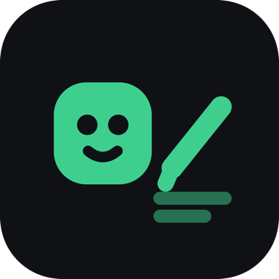
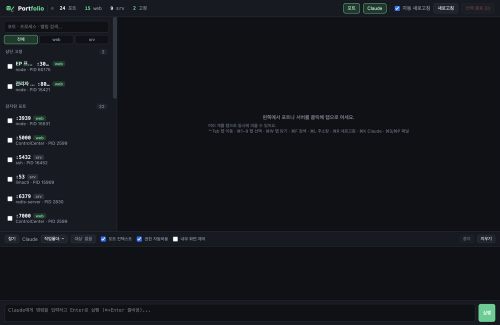

<div align="center">



# Portfolio

**로컬 개발 포트를 한곳에서 관리하는 IDE형 데스크톱 앱**
*port + folio — 흩어진 포트를 하나로 모으다*

포트 스캔 · 종료 · 프론트 미리보기 · 서버 로그 · **AI로 내부 화면 직접 조작**까지, 한 창에서.


<br />



</div>

---

## 📥 다운로드

[**최신 릴리스**](https://github.com/bamin0422/portfolio/releases/latest)에서 받으세요:

| 플랫폼 | 파일 |
|---|---|
| 🍎 macOS (Apple Silicon) | `Portfolio-0.1.0-arm64.dmg` |
| 🍎 macOS (Intel) | `Portfolio-0.1.0.dmg` |
| 🪟 Windows | `Portfolio Setup 0.1.0.exe` |

```bash
# Homebrew (macOS)
brew install --cask bamin0422/tap/portfolio
```

> AI 기능을 쓰려면 [Claude CLI](https://claude.com/claude-code)가 설치돼 있어야 합니다.

> **macOS 첫 실행**: 서명·공증되지 않은 앱이라 처음엔 Gatekeeper가 막을 수 있습니다.
> **우클릭 → 열기**로 실행하거나, 터미널에서 `xattr -cr /Applications/Portfolio.app` 후 실행하세요.
> (Homebrew로 설치하면 자동으로 처리됩니다.)

---

## 왜 Portfolio인가

로컬에서 개발 서버·프론트를 여러 개 띄우다 보면 — 어느 포트가 뭐였는지 헷갈리고, 종료도 번거롭고, 미리보기·로그는 여기저기 흩어집니다. Portfolio는 그걸 **한 창**에 모읍니다. 그리고 여기서 한 발 더 나아가, **Claude에게 명령해서 앱 안에 띄워진 화면을 직접 조작**할 수 있습니다.

## ✨ 주요 기능

| | |
|---|---|
| 🔍 **포트 자동 스캔** | `lsof`로 LISTEN 중인 포트를 3초마다 감지 — 포트·PID·프로세스·경로 |
| 🏷️ **이름 변경 & 상단 고정** | 포트에 별칭 지정, 자주 쓰는 포트는 전용 그룹으로 고정 (꺼지면 "꺼짐" 표시) |
| 🟢 **web / srv 필터 & 검색** | HTTP 프로브로 타입 판별, 포트·프로세스·별칭 실시간 검색 |
| 🗂️ **탭 UI** | 여러 포트·서버를 탭으로 동시에, 드래그로 순서 변경 |
| 🖥️ **프론트 미리보기** | 웹 포트를 앱 내 임베드 + 편집 가능한 주소창 + 개발자도구 |
| 📜 **서버 로그** | 앱에서 직접 실행한 서버의 실시간 stdout/stderr |
| 🤖 **Claude 명령** | 하단 프롬프트로 `claude`를 실행, 결과 스트리밍 |
| 🎯 **AI 내부 화면 제어** | Claude가 앱 안 미리보기 화면을 직접 조작 — *별도 브라우저 없이* |

## 🎯 AI 내부 화면 제어 (핵심 차별점)

Portfolio는 앱 자체 MCP 서버를 내장합니다. `내부 화면 제어`를 켜면, Claude가 아래 도구로 **앱 안에 띄워진 미리보기 화면**을 직접 조작합니다.

```
$ 3000번 포트 화면에서 "메일쓰기" 눌러줘

🔧 portfolio_snapshot(port: 3000)   ← 화면의 클릭 가능한 요소 파악
🔧 portfolio_click(port: 3000, text: "메일쓰기")
메일쓰기 버튼 클릭 완료! 작성 화면으로 이동했어요 ✅
```

| 도구 | 설명 |
|---|---|
| `portfolio_snapshot` | 화면의 클릭·입력 가능한 요소 목록 |
| `portfolio_click` | 텍스트로 요소 클릭 |
| `portfolio_type` | 셀렉터로 입력 |
| `portfolio_eval` | 화면 컨텍스트에서 JS 실행 |
| `portfolio_reload` / `portfolio_list` | 새로고침 / 열린 포트 목록 |

> 외부 CDP 도구(chrome-devtools MCP·Playwright)는 Electron webview를 조작하지 못합니다. Portfolio는 `webContents`를 직접 제어하는 자체 MCP로 이 문제를 해결했습니다. 런타임 의존성은 **0** — Electron 바이너리를 Node로 재활용합니다.

## ⌨️ 단축키

| 단축키 | 기능 | 단축키 | 기능 |
|---|---|---|---|
| `⌃Tab` / `⌃⇧Tab` | 다음 / 이전 탭 | `⌘F` | 포트 검색 |
| `⌘1`~`9` | n번째 탭 | `⌘L` | 주소창 |
| `⌘W` | 탭 닫기 | `⌘R` | 미리보기 새로고침 |
| `⌘S` / `⌘P` | 왼쪽 / 아래 패널 | `⌘K` | Claude 입력창 |

## 🚀 설치 & 실행

```bash
git clone <repo-url> portfolio
cd portfolio
npm install
npm start          # 개발 실행
```

### 앱으로 빌드 (설치형)

```bash
npm run dist:mac   # macOS .dmg / .zip
npm run dist       # 현재 플랫폼
```

빌드 결과물은 `dist/`에 생성됩니다.

## 📋 요구사항

- **Node.js** 18+
- **[Claude CLI](https://claude.com/claude-code)** — AI 명령·내부 화면 제어 기능용 (`claude`가 PATH에 있어야 함)
- macOS / Windows / Linux

## 🗺️ 로드맵

- [ ] 다국어 지원 (English · 한국어 · 日本語 · 中文)
- [ ] 포트 그룹/프로필 저장
- [ ] 원격/도커 포트

## 📄 라이선스

MIT

---

<div align="center">
<sub>Built with Electron · Made for developers who juggle too many ports</sub>
</div>
